# MessageBroker Documentation
This project was created with [Angular CLI](https://github.com/angular/angular-cli) version 7.3.9 and [NodeJS](https://nodejs.org/) version 10.15.3.  


----

This code was developed by Antonio Mignano, working under the supervision of Lorenzo De Carli at Worcester Polytechnic Institute. Questions/feedback may be directed at Lorenzo De Carli (lorenzo.decarli@ucalgary.ca).

For information about the project within which this code was developed, please refer to our publication: L. De Carli, A. Mignano, "Network Security for Home IoT Devices Must Involve the User: a Position Paper", FPS 2020. [PDF](https://ldklab.github.io/assets/papers/fps20-iot.pdf)

----

Table of Contents
- [MessageBroker Documentation](#messagebroker-documentation)
  - [1. Starting Message Broker](#1-starting-message-broker)
  - [2. SONOS Speaker](#2-sonos-speaker)
  - [3. Smart TV](#3-smart-tv)
  - [4. Smartphone App](#4-smartphone-app)
  - [5. Add devices to the Message Broker network](#5-add-devices-to-the-message-broker-network)
  - [6. Send interaction](#6-send-interaction)


## 1. Starting Message Broker
GitHub repository: https://github.com/ldklab/testbed-message-broker.

After downloading and extracting it to a folder, open the project with any editor. Using Visual Studio Code is highly suggested.

1. First of all, it is necessary to install all the dependencies. Open a terminal inside Visual Studio Code (`` CTRL+` ``) or a system terminal, move to the project folder and execute:
```
npm install
```

2. Now run Angular development server (front-end):
```
ng serve
```
It should show the following result:
<p align="center">
  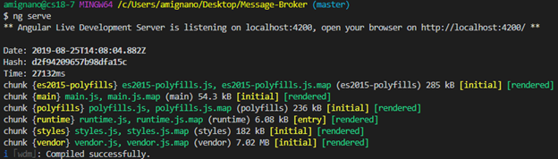
</p>

3. Now it is time to run the back-end, the real application. On another terminal (click the `+` icon on the top right corner of the terminal in VSC) run the following command:
```
nodemon server.js
```
It should show the following result:

<p align="center">
  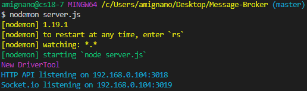
</p>

4. The system is now up and running, to access the interface open a web browser and go to:
```
http://localhost:4200/
```


Remember that `ng serve` runs a development server for the angular project. To build run `ng build`. The build artifacts will be stored in the `dist/` directory.

---


## 2. SONOS Speaker
No actions are required for the speaker to be discoverable by the MB. It has just to be on the same network of the Message Broker.

---

<a name="smart_tv"></a>
## 3. Smart TV
GitHub repository: https://github.com/ldklab/testbed-tv-app.

Since the Smart TV app is emulated using Angular, the steps to run it are almost equal to the ones of the Message Broker:

1. Install dependencies: `npm install`
2. Run Angular development server: `ng serve`
3. On another terminal move to the `./server` folder and execute: `nodemon index.js`
4. On a web browser visit: `http://localhost:4200/`

---


## 4. Smartphone App
GitHub repository: https://github.com/ldklab/testbed-smartphone-app.

1. After downloading and opening the project with Android Studio connect an Android device via USB to the computer and press the green run () button in the top right corner.

<p align="center">
  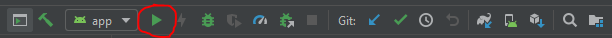
</p>

2. Wait for the new prompt to show to show the phone connected via USB. If it is not shown, it may be required to enable `USB debugging` from the phone’s settings.

3. Select the device and wait for the app to be installed on it.

<p align="center">
  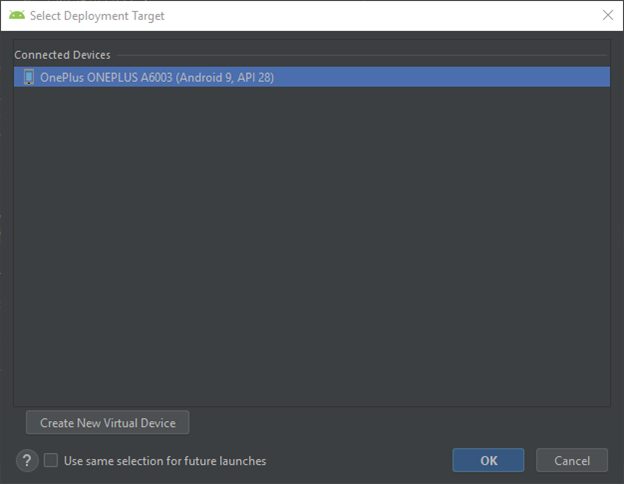
</p>

4. After the application is installed, it is not required to leave the phone plugged, although it may be useful to go on the `Run` tab (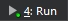) in the bottom left corner, to inspect the debugging messages sent from the app.

<p align="center">
  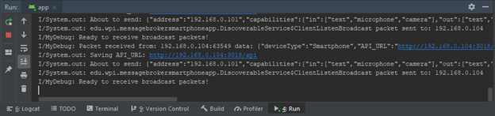
</p>

---

## 5. Add devices to the Message Broker network

1. On the `Connected devices` card click the 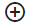 sign, and wait for the popup to load the discovered devices.

<p align="center">
  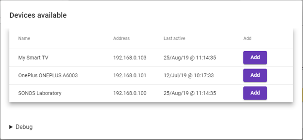
</p>

2. Click `Add` next to all the devices that are needed to join the Message Broker network. They should appear in the `Connected devices` card.

<p align="center">
  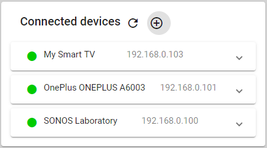
</p>

---


## 6. Send interaction

1. In the `Test area` card write complete all the mandatory field (title and description). It is also possible to choose to which device the interaction has to be sent. Custom inputs can be added or a set of predefined test fields can be user (clicking on `Test Fields` button).
2. 
<p align="center">
  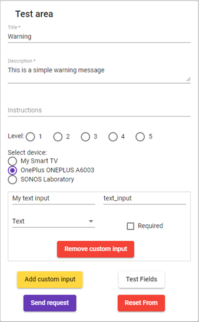
</p>

2. After sending it, it should appear as pending interaction (yellow dot) in the `Latest interactions` card.

<p align="center">
  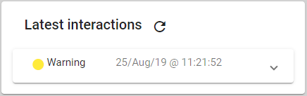
</p>
